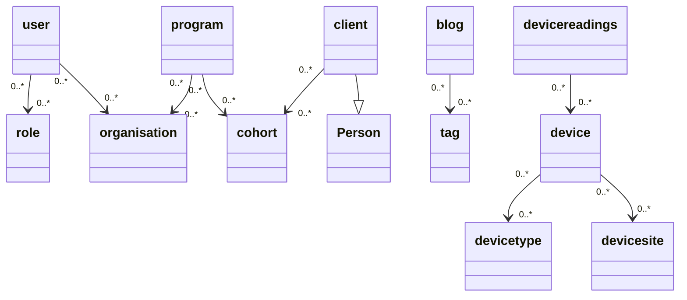

# Crudio

Github: `https://github.com/Qiksar/crudio`
NPM:    `https://www.npmjs.com/package/@qiksar/crudio`

Crudio creates test data in memory and the automatically saves it to a postgres database, via Hasura GraphQL. 

## Get started quick - Let's create a database and fill it with data!

If you already understand the value of automatically generated test data, and you love Postgres and Hasura as much as we do, and you're impatient, then you can't wait to read to the end of this line and find out how to actually try it out without any fuss, or verbose instructions...ok we'll stop teasing you now!

`wget -O - https://raw.githubusercontent.com/qiksar/crudio/main/tools/init.sh | bash`

- Fetches the demonstration initialisation script from Github and executes it
- The initialisation script executes and fetches a demonstration repository and a docker-compose file
- The demonstration repository describes a collection of data such as organisations and people
- The docker compose file creates Postgres and Hasura docker containers
- Crudio then executes and populates the database with all of the test data created, like organisations, peoples, programs and so one

Once the script has executed, browse to `http://localhost:6789` to visit the Hasura console.
Use the Hasura console to setup tracking.

In less than 2 minutes you have created a database filled with rich demonstration data that could be used by your new prototype application.
By setting up traacking in Hasura, you have instantly gained an API to help you read and maintain the data.

You now have a prototype database to beging your next rapid prototyping project, and so far, you haven't had to write one line of code!

## Command Line Arguments

You can run Crudio without having to install anything specfic. You will just need `docker` and `docker-compose` in order to create the database and Hasura containers.

Example:

`npx crudio -w -r repo/repo.json -i repo/include.json`

Options:

-e, --hasuraEndpoint <endpoint>   GraphQL endpoint
  Default value: http://localhost:6789")

-a, --hasuraAdminSecret <secret>  Secret to access administrative privileges
  Default value: crudio

-k, --idField <idfield>           Default name for primary key column
  Default value: id

-w, --wipe                        Drop all tables in the schema if they already exist
  Default value: true

-s, --schema <schema>             Place tables in the nominated schema
  Default value: crudio

-r, --repo <repo_file>            Repository definition file (JSON)
  Note: Must be a JSON format file

-i, --include <include_file>      Merge an additional repository definition (OPTIONAL)
  Note: Must be a JSON format file

## Next Steps

Read more detail about the value of creating test data, and how Crudio helps your prototyping and testing activities go faster.

Once you have your Postgres and Hasura containers running, refer to the Sample Queries section below for some quick graphql query examples. The examples are intended to show you how easy it is to explore the test data with the Hasura Console, and prove the data is easy to understand and looks sensible.

# About Crudio

Automatically creating test data, which you know nothing about, other than the structure, is a powerful way to build prototypes and test software systems.

All you need to do is describe the basic shape of your data model, like organisations (customers, perhaps), who have users. If your model uses pre-defined entities (schema of data records), then you can include and use the entity definitions, and be up and running in minutes.

You could take Crudio yourself and make it do lots of things. We love GraphQL, so we adopted the powerful combination of Postgres and Hasura. We did this because we can use two docker containers and in seconds we have a fast and modern way to access our data, either through an API or through the Hasura Console.

So imagine this...your horrible boss (seen the movie?), demands that, by tommorrow, you build a demonstration system that manages multiple organisations, each with a collection of users, where each organisation provides community services to people who are grouped by their specific needs. 

How do you respond to that when you don't even have a database setup, you don't have any data to work with, and you don't have any APIs that a prototype app could use?!

You got nothing! So, how might you quickly create test data that looks sensible when you show a prototype application to users and seek their feedback?

Well the answer is, "fake it, til you make it!""

For our above example, we need a fake database, one which we can describe as needing organisations, users, programs, clients, and cohorts. We need to populate data tables, create users and organizations, randomly assign the users to organizations. Create fake programs, which are services that organisations deliver to their local communities.  Create clients and chorts who are serviced through the program. Next, distribute clients into cohorts and cohorts to programs. Now we have a lot of fake people, in fake cohorts, in fake programs all assigned to fake organisations. 

Essentially, just by describing the data you want, Crudio will create a rich data graph, generating data entities, and connecting them to each other...  user->organisation  client->cohort->program etc.

The data will be created rapidly, saved into a Postgres database, and then Hasura can be used to query and manage the data.

Phew! That's what Crudio does. It can't save the world, but it can help you change a Horrible Boss into a Happy Boss!

## Key Objectives
These are the key objectives of automating the creation of test data:

1. Fake data can be saved to a database.
   
   * We might normally just keep our fake data in memory, for automated testing.
   * But we can save it to a database, so that when we run demonstrations, the data is predictable and supports rehearsed and repeatable story telling. 
   * This way in our example data model, we would see the same organisations every time we use the saved data with our prototype app.
   * You can even save the data to a JSON file and then use it for in memory testing.
   
2. The definition of how to create the data and the data itself are managed as a unit, called a repository.
   * This way we can easily version control the data model with our prototype application and automated tests.
   * Tracing can be traced back data to the rules which created it, and this all sits alongside the tests which help us to be more confident that our prototype works.
   
3. The data should make sense to users, and not be totally random. A data entity should be consistent for the context in which it is generated.
   * What?! Well consider how most people create random data, using random string. We would create random people, like "Joe Bloggs", but then give him an email address of "some.user@somewhere.com"
   * It would be better to create, "joe.bloggs@healthdepartment.com", which makes much more sense to users when they see the data.
   * For example, a generated Person with first and last name of Bob Smith has an email address of bob.smith@somewhere.com, as opposed to having random values.

Simply put, fake data should be sensible and useful to help build systems faster,  that can be used to engage stakeholders to gather feedback. As far as practicable, the data should be coherent and not create questions about why it doesn't appear to be sensible and relevant to the problem domain.

## Test Data Changes Constantly

Bear this one point in mind, every time we run our data generation process, we get a completely new and unique set of data. 

Let's say you run Crudio right now, and search the users table and find "Joe Bloggs", if you run Crudio again, moments later, you might not see "Joe Bloggs", because that name might not be randomly generated again.

This is why automated test data is so awesome. It can stop you from making assumptions about the values of data. You can create data which is good, bad, simple, challenging, all in the interests of ensuring you can present your app with meaningful data, and ensure your app is thoroughly tested.

### Here's a simple view of what our fake data model might look like

*Note*: If you're viewing this file from NPM you may not see the Mermaid diagram.

`View this file on Github: https://github.com/Qiksar/crudio/blob/main/README.md`

See how the model depicts not for profit organisations that have users (their staff). Each has many programs that provide services to the community. Different groups of clients are based in cohorts which are serviced through a program. The organisation publishes a blog, and articles have tags to group the blog posts together by special interest.

This is what the data model might look like:



Crudio creates this example data model in-memory, then fills it with meaningful data. You could just access the data in-memory if that means you get to prototyping your app faster, or Crudio will create a database and save all the data into it, so your prototype starts to feel very real.


# Further Information

## Test Respositories
We call the definition of a data model a repsository. Sorry, that's not a smart name when you have to pull this project for a Github repo! We may change that in future once we think of a better name. 

A repository describes the data model that you require. Refer below to find two example repositories:

Folder: `repo`

|File|Purpose|
|-|-|
|`repo.json`|Defines the demonstration respository, as a JSON object. In here, you will find descriptions of the data objects (organisation, client, etc.)
|`base.json`|Includes all of the base repository components include the base entity, snippets and generators
|`base_entity.json`|Contains the base entity from which all other entities should be based (use - `"inhert": "Entity"` on your entity definitions)
|`base_generators.json`|Contains a basic set of generators for various data such as people's names, places, times and dates
|`base_snippets.json`|Contains pre-defined fields which can be used to rapidly build entities

## Unit Test Folder

Under the `~/test/unit` folder are a collection of Jest test specifications to test the command line interface, data creation, and the (coming soon...) script execution engine.

# Get the code

Clone this project from: `https://github.com/Qiksar/crudio`

## NPM scripts

- Open the project with Visual Studio code.
- Look at the NPM scripts in `package.json`
- `test` : Run the unit tests
- `build` : Compile the typescript
- `start_cli` : Test the command line function
- `up` : Use docker-compose to build the demo containers (you must run this before you can run the tests)
- `down` : Stop the docker containers
- `remove` : Stop and remove the docker containers and related images

## Review the Unit Tests

It's really cool to be able to create complete test database systems from the command line. But the Crudio repository provides you with the full code.

Maybe you want to become a contributor? Jump right in and clone the repo and take a look at the unit tests.

You can see how simple Crudio is to use, by looking at the unit tests in `test/unit/fakedb.spec.ts`.

Here is what the key unit tests do:

- Test flatted - This test proves that we can save JSON data which may contain circular references. JSON.stringify doesn't work for this purpose, but flatted is perfect!
- Ensure that Crudio has the ability to create unique values for fields. This is important if you want everyone to have a unique email address that you might use to login later.
- Load the repository - This loads the repo/repo.json file which describes a demo data model, and it uses it to create a large in-memory JSON object, and then it tests the object contains the right data.
- Save and load - This ensures that we can save and load the JSON data. We might want to do this in order to work with a snapshot of data, whereby our data looks the same every time we load it. If we just run Crudio everytime we get new random data.
- Populate database - This is the super power. Crudio creates a database schema in Postgres called `crudio`, creates all the tables, loads the test data in to the database, then adds all of the foreign keys that connect the data together.

When the tests have run, open the [Hasura Console](http://localhost:6789), go to the `DATA` tab, and track the tables and relationships, and you're ready to go with GraphQL.


# Working in Hasura Console - Example GraphQL Queries 

Once you have tracked the tables and relationships in [Hasura Console](http://localhost:6789), go to the `API` tab, and copy, paste and run the following GraphQL queries to get started:

## Get a list of blog posts with their related tags
```
{
  crudio_Blogs {
    article_text
    BlogTags {
      tagByTag {
        name
      }
    }
  }
}
```

## Get a list of users with their organisations and prove their email address matches the orgniation they work for
```
{
  crudio_Users{
    firstname
    lastname
    email
    organisationByOrganisation {
      name
    }
  }
}
```

## Get values for IoT devices which measure blood pressure
```
{
  crudio_test_DeviceReadings(
    where: {
    deviceByDevice: {
      deviceTypeByDevicetype: {
        name: {_eq: "bp"}
       }
      }
    })
  {
   value
  }
}

``` 

## List organisation users assigned to the CEO and CFO role
```
{
  CEO:crudio_test_Users(where: {organisationRoleByOrganisationrole: {name: {_eq: "CEO"}}}) {
    firstname
    lastname
    email
    organisationByOrganisation {
      name
    }
    organisationRoleByOrganisationrole{
      name
    }
  }
  
  CFO:crudio_test_Users(where: {organisationRoleByOrganisationrole: {name: {_eq: "CFO"}}}) {
    firstname
    lastname
    email
    organisationByOrganisation {
      name
    }
    organisationRoleByOrganisationrole{
      name
    }
  }
}
```

# The Crudio data repository structure

The main purpose of a repository (*repo*) is to act as a container for test data.

The test data itself is a collection of data entities, like Person or Organisation.

Imagine you want 4000 people connected with one organisation, so you can load test your application. You don't want to type all of the data in. So you might be tempted to use randomly generated strings as people's first and last name, but then you also want an email address, and would that be any old random text, or should it be the person's first and last name joined to make an email address?

Having random data that looks sensible is critical to help your test team reason about how well the application is working, and it helps when you're doing demonstrations that the data looks pretty sensible.

Let's take a close look at the JSON structure of a repository...

**repo.json**

Here is the basic outline

```
{
   include:[]
   generators: {}
   entities:{}
}
```


Let's tell Crudio that we want to include two files, like a standard set of random data generators, and our list of application specific data entities...
```
{
  "include": ["repo/standard_generators.json", "repo/repo_entities.json"],
  "generators": {
    ...removed for brevity...
  }
}
```

Let's peek at the `standard_generators.json` file:

```
{
  "generators": {
    "PersonGenerator": {
      "title": "Dr;Mr;Miss;Mrs;Ms;Sir;Lady",
      "firstname": "Bob;Robert;Rob;Jane;",
      "lastname": "Smith;Brown;Jones;Robertson;",
      "fullname": "[title] [firstname] [lastname]"
    },

    "PlaceGenerator": {
      "address": "[house], [street] [streettype], [place], [state] [postcode]",
      "state": "WA;SA;NSW;VIC;NT;TAS;ACT;QLD;",
      "postcode": "1000;2000;3000;4000;5000;6000;7000;",
      "street": "Strawberry;Juniper;Blackberry;Carlton;Tall;Short;",
      "place": "Success;Hilarys;Carwoola;Kiara;Piara;Armidale;Coogee;",
      "streettype": "Road;Street;Way;Close;Pass;Highway;Parade;Boulevard;Crescent;",
      "house": "1;2;3;4;5;6;7;8;9;10;101;305;32a;32b;32c;"
    }
}
```

It's pretty easy to understand that in order to generate a person we need multiple data fields for their name. Then to generate an address for the person, we need a way to generate places.

Meanwhile in `repo_entities.json` we see entities that are used in our data model, like `Organisation` using generators from `standard_generators.json`, which were included.

```
  "entities": {
    "Entity": {
      "abstract": true,
      "id": {
        "type": "uuid",
        "name": "id",
        "key": true,
        "generator": "[uuid]"
      },
      "created": {
        "type": "timestamp",
        "name": "created",
        "generator": "[timestamp]"
      },
      "deleted": { "type": "timestamp", "name": "deleted" }
    },

    "Organisation": {
      "inherits": "Entity",
      "name": {
        "type": "string",
        "name": "name",
        "generator": "[organisation_name]"
      },
      "address": {
        "type": "string",
        "name": "address",
        "generator": "[address]"
      },
      "email": {
        "type": "string",
        "name": "email",
        "generator": "contact@[!name].org.au"
      }
    }
}
```

In the above example we also say that an `Organisation` inherits some fields from `Entity`. This means we can have all of our database objects setup with a common set of fields, like an ID and date created or deleted.

Do take time to read the example JSON files in the `repo` folder. These files are intended to help us automatically test Crudio, thoroughly, but are also intended to be a resource from which you can learn.

# Wrapping up

Take some time to examine the full `repo.json`, `repo_entities.json` and `standard_generators.json` files. You will quickly understand how you can break large repos into smaller parts that can be reused over and over. This approach gives you a very simple way to create consistent data for testing a multitude of applications.

# Join Us - Crudio: Free Forever

Please do join the effort to make Crudio even more awesome. Our mission is to expand Crudio to generate data for almost every scenario. We need your help, ideas, feedback and encouragement to achieve that.

And by the way...Crudio is free forever. We don't intend to start launching "Enterprise Versions" and subscriptions etc. Crudio belongs to all of us, is free to use for all of us, forever. 

# Example Queries

Simply copy, paste and execute the queries below, using the Hasura Console 

URL: `http://localhost:6789/console/`

# Roadmap

## More work on expressing relationships
At the moment we are thinking about the different types of relationships between entities, such as users and which departments they work in.

## Scipting engine
There is a unit test just to see if we can stimulate discussion about a scripting engine. We are looking at `eval` which everyone says is evil, but Crudio is not designed as a production tool, so you won't be letting third parties write scripts that execute on your platform.

But why would you need scripting? We are trying to answer many common out of the box use cases, like creating organisations, with teams, roles, and clients. When we consider modelling the kind of data that IoT or Health devices create, you might not want the data to be so random. If you don't care, you're already good to go, as our current demonstration model shows.

We are envisioning a use case, like trying to make environmental monitoring data, where a timestamp appears to progress through a 24 hour period, and as it does, a daylight sensor increases in value, and as night approaches, the sensor value falls as it gets darker. This capability would create very convincing test data.

## Visualisation

This is about being able to output a graphical version of the data model so you can quickly review and validate it, even work with others, non-technical people, to ask if the data model makes sense in real-life.

## User interface

Primarily, Crudio was envisioned essentially as a command line, and unit test tool. But as it progress, it seems to call for a web-app which would enable us to create our models in a more friendly, less code-like way.

# Credits

Thank you to the key repository owners below:

Data sources
Used to create a large list of first names: https://github.com/hadley/data-baby-names/blob/master/baby-names.csv
