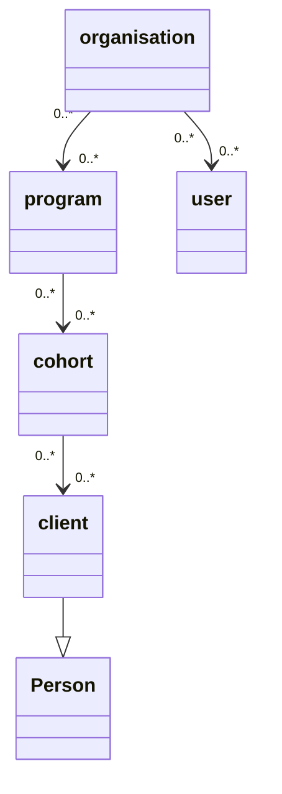

# Crudio

Github: `https://github.com/Qiksar/crudio`

Crudio creates test data in memory and the automatically saves it to a postgres database, via Hasura GraphQL. 

## Get started quick - Let's create a database and fill it with data!

`wget -O - https://raw.githubusercontent.com/qiksar/crudio/main/tools/init.sh | bash`

- Fetches the demonstration initialisation script from Github and executes it
- The initialisation script executes and fetches a demonstration repository and a docker-compose file
- The demonstration repository describes a collection of data such as organisations and people
- The docker compose file creates Postgres and Hasura docker containers
- Crudio then executes and populates the database with all of the test data created, like organisations, peoples, programs and so one

Once the script has executed, browse to `http://localhost:6789` to visit the Hasura console.
Use the Hasura console to setup tracking.

In less than 2 minutes you have created a database filled with rich demonstration data that could be used by your new prototype application.
By setting up traacking in Hasura, you have instantly gained an API to help you read and maintain the data.

You now have a prototype database to beging your next rapid prototyping project, and so far, you haven't had to write one line of code!


# Crudio - Fake Data
Crudio provides a means of creating test data for rapid prototyping and automated testing.

The low down: You're asked to build a system to gather feedback from the community which various organizations can use to measure stakeholder sentiment. But you don't have any data for organizations, their staff, the clients they service, the survey designs or responses to surveys. 

You got nothing! So, how might you quickly create test data that looks sensible when you show a prototype application to users and seek their feedback?

Well the answer is fake it, til you make it!

For our above example, we need a fake database, one which we can describe as needing organisations, programs, clients, and cohorts.

 We need to create users and organizations, randomly assign the users to organizations. Create fake programs, which are services that organisations deliver to their local communities.  Create clients and chorts who are serviced through the program. Next, distribute clients into cohorts and cohorts to programs. Now we have a lot of fake people, in fake cohorts, in fake programs all assigned to fake organisations. 

Essentially, just by describing the data you want, Crudio will create a rich data graph, generating data entities, and connecting them to each other...  user->organisation  client->cohort->program etc.

### Here's a simple view of what our fake data model might look like

*Note*: If you're viewing this file from NPM you may not see the Mermaid diagram.

`View this file on Github: https://github.com/Qiksar/crudio/blob/main/README.md`



Let's imagine we have a large not for profit organisation. It has many programs that provide services to the community. So we can think of the different groups of people as clients, and clients having similar needs form a cohort, which is supported through a program. 

## Key Objectives
These are the key objectives of Fake Data

Bear this one point in mind, every time we run our fake data generation process, we get a completely new and unique set of data. If right now we have fake data with a person in it called, "Joe Bloggs", next time we might not have a person of that name, as the data will change.

1. Fake data can be saved to a database.
   
   * We might normally just keep our fake data in memory, for automated testing.
   * But we can save it to a database, so that when we run demonstrations, the data is predictable and supports rehearsed and repeatable story telling. 
   * This way in our example data model, we would see the same organisations every time we use the saved data with our prototype app.
   * You can even save the data to a JSON file and then use it for in memory testing.
   
2. The definition of how to create the data and the data itself are managed as a unit, called a repository.
   * This way we can easily version control the data model with our prototype application and automated tests.
   * Tracing can be traced back data to the rules which created it, and this all sits alongside the tests which help us to be more confident that our prototype works.
   
3. The data should make sense to users, and not be totally random. A data entity should be consistent for the context in which it is generated.
   * What?! Well consider how most people create random data, using random string. We would create random people, like "Joe Bloggs", but then give him an email address of "some.user@somewhere.com"
   * It would be better to create, "joe.bloggs@healthdepartment.com", which makes much more sense to users when they see the data.
   * For example, a generated Person with first and last name of Bob Smith has an email address of bob.smith@somewhere.com, as opposed to having random values.

Simply put, fake data should be sensible and useful to help build systems faster,  that can be used to engage stakeholders to gather feedback. As far as practicable, the data should be coherent and not create questions about why it doesn't appear to be sensible and relevant to the problem domain.

## Further Information

### Test Respositories
Repositories describe the data that they wish to be populated with. Refer below to find two example repositories:

Folder: `repo`

`repo.json` - Defines the demonstration respository, as a JSON object. In here, you will find descriptions of the data objects (organisation, client, etc.)
`standard_generators.json` - This file is merged with the repo, through an `include` JSON node. It contains all the different generators which create the random data, such as people's names and ages.
`fakedb.spec.ts` - Demonstrates how to trigger the data generation process and access the generated data.

  
# Get the code

Clone this repo from: `https://github.com/Qiksar/crudio`


## NPM scripts

- Open the project with Visual Studio code.
- Look at the NPM scripts in `package.json`
- `test` : Run the unit tests
- `build` : Compile the typescript
- `start_cli` : Test the command line function
- `up` : Use docker-compose to build the demo containers (you must run this before you can run the tests)
- `down` : Stop the docker containers
- `remove` : Stop and remove the docker containers and related images


## Get started

it's really cool to be able to create complete test database systems from the command line. But the Crudio repository provides you with the full code.

You can see how simple it is to use, by looking at the unit tests in `test/unit/fakedb.spec.ts`.

Here is what the key unit tests do:

- Test flatted - This test proves that we can save JSON data which may contain circular references. JSON.stringify doesn't work for this purpose, but flatted is perfect!
- Load the repository - This loads the repo/repo.json file which describes a demo data model, and it uses it to create a large in-memory JSON object, and then it tests the object contains the right data.
- Save and load - This ensures that we can save and load the JSON data. We might want to do this in order to work with a snapshot of data, whereby our data looks the same every time we load it. If we just run Crudio everytime we get new random data.
- Populate database - This is the super power. Crudio creates a database schema in Postgres called `crudio`, creates all the tables, loads the test data in to the database, then adds all of the foreign keys that connect the data together.

When the tests have run, go take a look in Hasura console, track the tables and relationships, and you're ready to go with GraphQL.

# The repo structure

The main purpose of a repository (*repo*) is to act as a container for test data.

The test data itself is a collection of data entities, like Person or Organisation.

Imagine you want 4000 people connected with one organisation, so you can load test your application. You don't want to type all of the data in. So you might be tempted to use randomly generated strings as people's first and last name, but then you also want an email address, and would that be any old random text, or should it be the person's first and last name joined to make an email address?

Having random data that looks sensible is critical to help your test team reason about how well the application is working, and it helps when you're doing demonstrations that the data looks pretty sensible.

Let's take a close look at the JSON structure of a repository...

**repo.json**

Here is the basic outline

```
{
   include:[]
   generators: {}
   entities:{}
   record_counts:{}
   relationships: {}
}
```


Let's tell Crudio that we want to include a file that we might use quite often, like a standard set of random data generators...
```
{
   include:["repo/standard_generators.json"]
}
```


Let's peek at the `standard_generators.json` file:

```
{
  "generators": {
    "PersonGenerator": {
      "title": "Dr;Mr;Miss;Mrs;Ms;Sir;Lady",
      "firstname": "Bob;Robert;Rob;Jane;",
      "middlename": "Bob;Robert;Rob;Jane;Fred;",
      "lastname": "Smith;Brown;Jones;Robertson;",
      "fullname": "[title] [firstname] [middlename] [lastname]"
    },

    "PlaceGenerator": {
      "address": "[house], [street] [streettype], [place], [state] [postcode]",
      "state": "WA;SA;NSW;VIC;NT;TAS;ACT;QLD;",
      "postcode": "1000;2000;3000;4000;5000;6000;7000;",
      "street": "Strawberry;Juniper;Blackberry;Carlton;Tall;Short;",
      "place": "Success;Hilarys;Carwoola;Kiara;Piara;Armidale;Coogee;",
      "streettype": "Road;Street;Way;Close;Pass;Highway;Parade;Boulevard;Crescent;",
      "house": "1;2;3;4;5;6;7;8;9;10;101;305;32a;32b;32c;"
    }
}
```

It's pretty easy to understand that in order to generate a person we need multiple data fields for their name. Then to generate an address for the person, we need a way to generate places.

Returning to `repo.json` we can now see thanks to the earlier include that we can create our `Organisation` entity using generators from `standard_generators.json`, which were included.

```
  "entities": {
    "Entity": {
      "abstract": true,
      "id": {
        "type": "uuid",
        "name": "id",
        "key": true,
        "generator": "[uuid]"
      },
      "created": {
        "type": "timestamp",
        "name": "created",
        "generator": "[timestamp]"
      },
      "deleted": { "type": "timestamp", "name": "deleted" }
    },

    "Organisation": {
      "inherits": "Entity",
      "name": {
        "type": "string",
        "name": "name",
        "generator": "[organisation_name]"
      },
      "address": {
        "type": "string",
        "name": "address",
        "generator": "[address]"
      },
      "email": {
        "type": "string",
        "name": "email",
        "generator": "contact@[!name].org.au"
      }
    }
}
```

In the above example we also say that an `Organisation` inherits some fields from `Entity`. This means we can have all of our database objects setup with a common set of fields, like an ID and date created or deleted.

# Wrapping up

Take some time to examine the full `repo.json` and `standard_generators.json` files. You will quickly understand how you can break large repos into smaller parts that can be reused over and over. This approach gives you a very simple way to create consistent data for testing a multitude of applications.

# Credits

Thank you to the key repository owners below:

Data sources
Used to create a large list of first names: https://github.com/hadley/data-baby-names/blob/master/baby-names.csv
