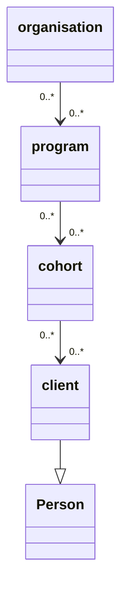

# Crudio

## Qiksar - It's a RAPP!
Crudio is part of a vision to create Qiksar - a Rapid Application Prototyping Platform (RAPP).

### Configuration over Code
A key principle of Qiksar is to leverage maximum configuration, and minimum code. Essentially, describe an application's data, and automatically generate an application with example data, ready to explore the key aspects of the application's prototype.

If you can prototype faster, you can get feedback faster, and make key decisions earlier.

### Always be Testing
A significant benefit of Qiksar is that your app is created from day one to be testable, and more importantly, can leverage automated testing techniques.

## Crudio - Fake Data
Crudio provides a means of creating test data for rapid prototyping and automated testing.

The low down: You're asked to build a system to gather feedback from the community which various organizations can use to measure stakeholder sentiment. But you don't have any data for organizations, their staff, the clients they service, the survey designs or responses to surveys. 

You got nothing! So, how might you quickly create test data that looks sensible when you show a prototype application to users and seek their feedback?

Well the answer is fake it, til you make it!

For our above example, we need a fake database, one which we can describe as needing organisations, programs, clients, and cohorts.

 We need to create users and organizations, randomly assign the users to organizations. Create fake programs, which are services that organisations deliver to their local communities.  Create clients and chorts who are serviced through the program. Next, distribute clients into cohorts and cohorts to programs. Now we have a lot of fake people, in fake cohorts, in fake programs all assigned to fake organisations. 

Essentially, just by describing the data you want, Crudio will create a rich data graph, generating data entities, and connecting them to each other...  user->organisation  client->cohort->program etc.

### Here's a simple view of what our fake data model looks like

## Key Objectives
These are the key objectives of Fake Data

Bear this one point in mind, every time we run our fake data generation process, we get a completely new and unique set of data. If right now we have fake data with a person in it called, "Joe Bloggs", next time we might not have a person of that name.

1. Fake data can be saved to a database.
   
   * We might normally just keep our fake data in memory, for automated testing.
   * But we can save it to a database, so that when we run demonstrations, the data is predictable and supports rehearsed story telling. 
   * This way in our example datamodel, we would see the same organisations ever time we use the saved data with our prototype app.
   
2. The definition of how to create the data and the data itself are managed as a unit, called a repository.
   * This way we can easily version control the data model with our prototype application and automated tests.
   * Tracing can be traced back data to the rules which created it, and this all sits alongside the tests which help us to be more confident that our prototype works.
   
3. The data should make sense to users, and not be totally random. A data entity should be consistent for the context in which it is generated.
   * What?! Well consider how most people create random data, using random string. We would create random people, like "Joe Bloggs", but then give him an email address of "some.user@somewhere.com"
   * It would be better to create, "joe.bloggs@healthdepartment.com", which makes much more sense to users when they see the data.
   * For example, a generated Person with first and last name of Bob Smith has an email address of bob.smith@somewhere.com, as opposed to having random values.

Simply put, fake data should be sensible and useful to help build systems faster,  that can be used to engage stakeholders to gather feedback. As far as practicable, the data should be coherent and not create questions about why it doesn't appear to be sensible and relevant to the problem domain.

## Further Information

### Test Respositories
Repositories describe the data that they wish to be populated with. Refer below to find two example repositories:

Folder: `test/unit`

`input/test_repo.ts` - This is the definition of a repository, which comprises the rules for data generation, and is augmented by the generation process to also contain the generated data.

The repository is described as a Typescript object.

`input/repo.json` - Also defines a respository, but this time it is expressed as a JSON object.

`fakedb.spec.ts` - Demonstrates how to trigger the data generation process and access the generated data.

# CRUD Operations
The initial motivation for Crudio was to accelerate the building of CRUD components, as being able to quickly show a stakeholder the fundamental data management aspects of a system can be reassuring.

To support CRUD, Crudio essentially provides a quick means of Creating, Reading, Updating and Deleting data.

Qiksar has advanced features to support displaying data in grids, and edit forms, that automatically discover columns, hide irrelevant (not user-friendly) data, and provide pagination and filtering.

## Hasura
Hasura has been adopted as the default GraphQL engine over Postgres, but this makes the data handling extremely oppinionated. But for now, it will do for rapid prototyping.

## Postgres
Postgres has been adopted for data management, as together with Hasura it supports the intention of rapid prototyping.

## Docker
Docker containers are created for Postgres and Hasura and built with docker-compose, so very little prior knowledge of any of the related technologies is required.

# Try it out
1. Build the docker containers using the docker-compose file in the *test* folder
   * `docker-compose up -d`

2. Run the unit tests with Jest
   * Ensure you have correctly pulled the code from Github, installed and setup everything you need locally to run the project.
   

3. Browse to hasura
   * `http://localhost:6789`

4. Setup tracking for all tables and all relationships
   * Use the Hasura console to setup table and relationship tracking
  

