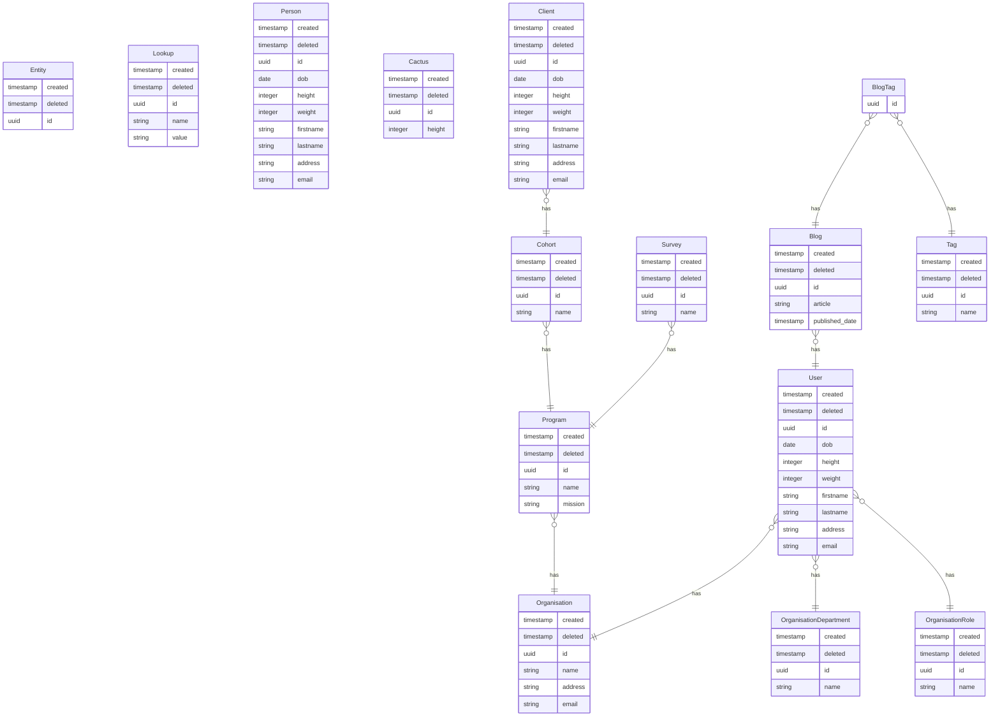

[HOME](README.md)

# Crudio

Using Crudio will enable you to rapidly build a database filled with data based upon a data model which you build with a simple JSON file. Your data model can leverage pre-defined entities, such as organisations and users, and specify details of how to connect entities (e.g. organisations, departments, roles and users). 

Why use it? You might be building a prototype app and want a database that is filled with sensible data, so you can spend more time coding your prototype UI and less time trying to create meaningful test data.

## More Information

When you are ready, and need more information about how to create your own data models and values, take a look here:
- [Crudio Syntax reference](documentation/repo-syntax.md)
- [How Crudio Works](documentation/how-crudio-works.md)

# CLI - Initialise New Project

Further information appears below for the CLI. But here is how to quickly initialise a new project:

Create a new folder called `crudio_test`, then create a `repo` folder which contains the sample data model for guidance...

Install crudio on your machine (note the use of the new `--location` option):

```
npm install @qiksar/crudio --location=global
```

NOTE: older versions of NPM use:
```
npm install @qiksar/crudio -g
```

# Initialise the new Crudio folder
```
npx -y @qiksar/crudio@latest -v -p crudio_test


cd crudio_test
```

# Build the containers, but you may want to ensure the port numbers don't clash with any of your active containers
```
docker-compose up -d
```

# Build and populate the data
```
npx -y @qiksar/crudio@latest -v -w -r repo/repo.json 
```

Browse to [Hasura Console](http://localhost:6789) (or whatever post you have used), to see the new database through Hasura GraphQL.

Read how to complete the next steps in Hasura, below. 

# Where to find the code and NPM package

Click here to find the Github project: [Github](https://github.com/Qiksar/crudio)

Click here to find the latest published package: [NPM](https://www.npmjs.com/package/@qiksar/crudio)

# GraphQL Queries - Hasura Console

Next, go to the `API` tab, and copy, paste and run the following GraphQL queries and you will see that Crudio has built a complete database filled with great looking data:

**`IMPORTANT NOTE:`** When you run the initialisation script, the database schema will be `crudio`, so the example queries below will work as is. But if you run the unit tests, the schema will be `crudio_test`, so you will have to prefix the tables like so... `crudio_test_Blogs` instead of `crudio_Blogs`

## Get a list of blog posts with their related tags
```graphql
{
  crudio_Blogs {
    article
    BlogTags {
      tagByTag {
        name
      }
    }
  }
}
```

## Get a list of users with their organisations and prove their email addresses match the orgniation they work for
```graphql
{
  crudio_Users{
    firstname
    lastname
    email
    organisationByOrganisation {
      name
    }
  }
}
```

## Get values for IoT devices which measure blood pressure
```graphql
{
  crudio_DeviceReadings(
    where: {
    deviceByDevice: {
      deviceTypeByDevicetype: {
        name: {_eq: "bp"}
       }
      }
    })
  {
   value
  }
}
``` 

## List all users with organisations, department and role
```graphql
{
  crudio_Users {
    firstname
    lastname
    email
    organisationByOrganisation {
      name
    }
    organisationDepartmentByOrganisationdepartment {
      name
    }
    organisationRoleByOrganisationrole {
      name
    }
  }
}
```


## List the CEO and CFO for all organisations
```graphql
{
  CEO:crudio_Users(where: {organisationRoleByOrganisationrole: {name: {_eq: "CEO"}}}) {
    firstname
    lastname
    email
    organisationByOrganisation {
      name
    }
    organisationRoleByOrganisationrole{
      name
    }
  }
  
  CFO:crudio_Users(where: {organisationRoleByOrganisationrole: {name: {_eq: "CFO"}}}) {
    firstname
    lastname
    email
    organisationByOrganisation {
      name
    }
    organisationRoleByOrganisationrole{
      name
    }
  }
}
```


# Build a Rich Demo From Github

These instructions will help you to build a completely functional demo, with quite a complex data model, so you can explore specific things that Crudio does in terms of creating and connecting database rows in relationships.

Ensure `docker` is installed, and then run this command to run a complete demonstration environment which includes, Postgres and Hasura GraphQL, where the database is populated with great looking data, and Hasura is ready, with two simple clicks (track tables and track relationships). There are even some example GraphQL queries below:

```
wget -O - https://raw.githubusercontent.com/qiksar/crudio/main/tools/init.sh | bash
```

- Fetches the initialisation script from Github and executes it
- The initialisation script uses a docker-compose file to build Postgres and Hasura docker containers
- Crudio then populates the database with awesome test data like organisations, departments, roles and users, IoT devices and their related data logs

Once the script has executed, browse to [Hasura Console](http://localhost:6789) and select the `DATA` tab and click the buttons to track all tables and then, track all relationships.

In less than 2 minutes you have created a database filled with rich demonstration data that could be used by your new prototype application.

By setting up tracking in Hasura, you have instantly gained a data management API to help you read and maintain the data.

You now have a prototype database to beging your next rapid prototyping project, and so far, you haven't had to write one line of code!

# Remove the Crudio Demo environment

Run the following command in the same folder as the `docker-compose.yml` file, and the demonstration Postgres and Hasura containers, and their images, will be removed.

```
docker-compose down --rmi all
```

You can then delete all of the files that were fetched from the Github repository. You may need administrative rights to delete the dbscripts folder, which is created by Postgres.

# Crudio CLI - Command Line Arguments

You can run Crudio without having to install anything specfic. 

You will just need `docker` and `docker-compose` in order to create the database and Hasura containers.

Example:

Build a database from the repo.json data model, and include all of the entities from the iot data model.


```
npx -y @qiksar/crudio@latest -v -w -r repo/repo.json -i repo/iot.json

# Note: this assumes you have either cloned the Github repository, or you have previously run the init script...
wget -O - https://raw.githubusercontent.com/qiksar/crudio/main/tools/init.sh | bash
```

```
CLI Options:

-v, --verbose                     Enable verbose logging
  Default value: false

-e, --hasuraEndpoint <endpoint>   GraphQL endpoint
  Default value: http://localhost:6789")

-a, --hasuraAdminSecret <secret>  Secret to access administrative privileges
  Default value: crudio

-k, --idField <idfield>           Default name for primary key column
  Default value: id

-w, --wipe                        Drop all tables in the schema if they already exist
  Default value: true

-s, --schema <schema>             Place tables in the nominated schema
  Default value: crudio

-r, --repo <repo_file>            Repository definition file (JSON)
  Note: Must be a JSON format file

-i, --include <include_file>      Merge an additional repository definition (OPTIONAL)
  Note: Must be a JSON format file

-d, --diagram <output_file>       Output Mermaid diagram of the data model
```

## Example Mermaid output
The following output is created using the `-d` option




# About Crudio

Automatically creating test data, which you know nothing about, other than the structure, is a powerful way to build prototypes and test software systems.

All you need to do is describe the basic shape of your data model, like organisations (customers, perhaps), who have users. If your model uses pre-defined entities (schema of data records), then you can include and use the entity definitions, and be up and running in minutes.

You could take Crudio yourself and make it do lots of things. We love GraphQL, so we adopted the powerful combination of Postgres and Hasura. We did this because we can use two docker containers and in seconds we have a fast and modern way to access our data, either through an API or through the Hasura Console.

So imagine this...your horrible boss (seen the movie?), demands that, by tommorrow, you build a demonstration system that manages multiple organisations, each with a collection of users, where each organisation provides community services to people who are grouped by their specific needs. 

How do you respond to that when you don't even have a database setup, you don't have any data to work with, and you don't have any APIs that a prototype app could use?!

You got nothing! So, how might you quickly create test data that looks sensible when you show a prototype application to users and seek their feedback?

Well the answer is, "fake it, til you make it!""

For our above example, we need a fake database, one which we can describe as needing organisations, users, programs, clients, and cohorts. We need to populate data tables, create users and organizations, randomly assign the users to organizations. Create fake programs, which are services that organisations deliver to their local communities.  Create clients and chorts who are serviced through the program. Next, distribute clients into cohorts and cohorts to programs. Now we have a lot of fake people, in fake cohorts, in fake programs all assigned to fake organisations. 

Essentially, just by describing the data you want, Crudio will create a rich data graph, generating data entities, and connecting them to each other...  user->organisation  client->cohort->program etc.

The data will be created rapidly, saved into a Postgres database, and then Hasura can be used to query and manage the data.

Phew! That's what Crudio does. It can't save the world, but it can help you change a Horrible Boss into a Happy Boss!

## Key Objectives
These are the key objectives of automating the creation of test data:

1. Fake data can be saved to a database.
   * We might normally just keep our fake data in memory, for automated testing.
   * But we can save it to a database, so that when we run demonstrations, the data is predictable and supports rehearsed and repeatable story telling. 
   * This way in our example data model, we would see the same organisations every time we use the saved data with our prototype app.
   * You can even save the data to a JSON file and then use it for in memory testing.
   
2. The definition of how to create the data and the data itself are managed as a unit, called a repository.
   * This way we can easily version control the data model with our prototype application and automated tests.
   * Tracing can be traced back data to the rules which created it, and this all sits alongside the tests which help us to be more confident that our prototype works.
   
3. The data should make sense to users, and not be totally random. A data entity should be consistent for the context in which it is generated.
   * What?! Well consider how most people create random data, using random string. We would create random people, like "Joe Bloggs", but then give him an email address of "some.user@somewhere.com"
   * It would be better to create, "joe.bloggs@healthdepartment.com", which makes much more sense to users when they see the data.
   * For example, a generated Person with first and last name of Bob Smith has an email address of bob.smith@somewhere.com, as opposed to having random values.

Simply put, fake data should be sensible and useful to help build systems faster,  that can be used to engage stakeholders to gather feedback. As far as practicable, the data should be coherent and not create questions about why it doesn't appear to be sensible and relevant to the problem domain.

## The Test Data Changes

Bear this one point in mind, every time we run our data generation process, we get a completely new and unique set of data. 

Let's say you run Crudio right now, and search the users table and find "Joe Bloggs", if you run Crudio again, moments later, you might not see "Joe Bloggs", because that name might not be randomly generated again.

This is why automated test data is so awesome. It can stop you from making assumptions about the values of data. You can create data which is good, bad, simple, challenging, all in the interests of ensuring you can present your app with meaningful data, and ensure your app is thoroughly tested.

## Here's a simple view of what our fake data model might look like

*Note*: If you're viewing this file from NPM you may not see the Mermaid diagram.

`View this file on Github: https://github.com/Qiksar/crudio/blob/main/README.md`

See how the model depicts not for profit organisations that have users (their staff). Each has many programs that provide services to the community. Different groups of clients are based in cohorts which are serviced through a program. The organisation publishes a blog, and articles have tags to group the blog posts together by special interest.

This is what the data model might look like:


Crudio creates this example data model in-memory, then fills it with meaningful data. You could just access the data in-memory if that means you get to prototyping your app faster, or Crudio will create a database and save all the data into it, so your prototype starts to feel very real.


# Further Information

## Test Respositories
We call the definition of a data model a repsository. Sorry, that's not a smart name when you have to pull this project for a Github repo! We may change that in future once we think of a better name. 

A repository describes the data model that you require. Refer below to find two example repositories:

Folder: `repo`

|File|Purpose|
|-|-|
|`repo.json`|Defines the demonstration respository, as a JSON object. In here, you will find descriptions of the data objects (organisation, client, etc.)
|`org_users.json`|Creates the organisations and then connects one user in each role of CEO, CFO etc. This is where Crudio gets super-awesome!
|`iot.json`|Include this data model to populate your database with IoT devices and related data
|`base.json`|Includes all of the base repository components include the base entity, snippets and generators
|`base_entity.json`|Contains the base entity from which all other entities should be based (use - `"inhert": "Entity"` on your entity definitions)
|`base_generators.json`|Contains a basic set of generators for various data such as people's names, places, times and dates
|`base_snippets.json`|Contains pre-defined fields which can be used to rapidly build entities

## Unit Test Folder

Under the `~/test/unit` folder are a collection of Jest test specifications to test the command line interface, data creation, and the (coming soon...) script execution engine.

# Get the code

Clone this project from: `https://github.com/Qiksar/crudio`

## NPM scripts

- Open the project with Visual Studio code.
- Look at the NPM scripts in `package.json`
- `test` : Run the unit tests
- `build` : Compile the typescript
- `start_cli` : Test the command line function
- `up` : Use docker-compose to build the demo containers (you must run this before you can run the tests)
- `down` : Stop the docker containers
- `remove` : Stop and remove the docker containers and related images

## Review the Unit Tests

It's really cool to be able to create complete test database systems from the command line. But the Crudio repository provides you with the full code.

Maybe you want to become a contributor? Jump right in and clone the repo and take a look at the unit tests.

You can see how simple Crudio is to use, by looking at the unit tests in `test/unit/fakedb.spec.ts`.

Here is what the key unit tests do:

- Test flatted - This test proves that we can save JSON data which may contain circular references. JSON.stringify doesn't work for this purpose, but flatted is perfect!
- Ensure that Crudio has the ability to create unique values for fields. This is important if you want everyone to have a unique email address that you might use to login later.
- Load the repository - This loads the repo/repo.json file which describes a demo data model, and it uses it to create a large in-memory JSON object, and then it tests the object contains the right data.
- Save and load - This ensures that we can save and load the JSON data. We might want to do this in order to work with a snapshot of data, whereby our data looks the same every time we load it. If we just run Crudio everytime we get new random data.
- Populate database - This is the super power. Crudio creates a database schema in Postgres called `crudio`, creates all the tables, loads the test data in to the database, then adds all of the foreign keys that connect the data together.

When the tests have run, open the [Hasura Console](http://localhost:6789), go to the `DATA` tab, and track the tables and relationships, and you're ready to go with GraphQL.

# The Crudio data repository structure

*NOTE* Crudio is rapidly evolving, and it is best to refer to [Crudio Syntax reference](repo-syntax.md) and the `repo` folder for up to date information.

The main purpose of a repository (*repo*) is to act as a container for test data. The test data itself is a collection of data entities, like Person or Organisation.

Imagine you want 4000 people connected with one organisation, so you can load test your application. You don't want to type all of the data in. So you might be tempted to use randomly generated strings as people's first and last name, but then you also want an email address, and would that be any old random text, or should it be the person's first and last name joined to make an email address?

Having random data that looks sensible is critical to help your test team reason about how well the application is working, and it helps when you're doing demonstrations that the data looks pretty sensible.

Let's take a close look at the JSON structure of a repository...

**repo.json**

Here is the basic outline

```
{
   include:[]
   generators: {}
   entities:{}
   scripts:{}
}
```


Let's tell Crudio that we want to include two files, like a standard set of random data generators, and our list of application specific data entities...
```
{
  "include": ["repo/standard_generators.json", "repo/repo_entities.json"],
  "generators": {
    ...removed for brevity...
  }
}
```

Let's peek at the `standard_generators.json` file:

```
{
  "generators": {
    "PersonGenerator": {
      "title": "Dr;Mr;Miss;Mrs;Ms;Sir;Lady",
      "firstname": "Bob;Robert;Rob;Jane;",
      "lastname": "Smith;Brown;Jones;Robertson;",
      "fullname": "[title] [firstname] [lastname]"
    },

    "PlaceGenerator": {
      "address": "[house], [street] [streettype], [place], [state] [postcode]",
      "state": "WA;SA;NSW;VIC;NT;TAS;ACT;QLD;",
      "postcode": "1000;2000;3000;4000;5000;6000;7000;",
      "street": "Strawberry;Juniper;Blackberry;Carlton;Tall;Short;",
      "place": "Success;Hilarys;Carwoola;Kiara;Piara;Armidale;Coogee;",
      "streettype": "Road;Street;Way;Close;Pass;Highway;Parade;Boulevard;Crescent;",
      "house": "1;2;3;4;5;6;7;8;9;10;101;305;32a;32b;32c;"
    }
}
```

It's pretty easy to understand that in order to generate a person we need multiple data fields for their name. Then to generate an address for the person, we need a way to generate places.

Meanwhile in `repo_entities.json` we see entities that are used in our data model, like `Organisation` using generators from `standard_generators.json`, which were included.

```
  "entities": {
    "Entity": {
      "abstract": true,
      "id": {
        "type": "uuid",
        "name": "id",
        "key": true,
        "generator": "[uuid]"
      },
      "created": {
        "type": "timestamp",
        "name": "created",
        "generator": "[timestamp]"
      },
      "deleted": { "type": "timestamp", "name": "deleted" }
    },

    "Organisation": {
      "inherits": "Entity",
      "name": {
        "type": "string",
        "name": "name",
        "generator": "[organisation_name]"
      },
      "address": {
        "type": "string",
        "name": "address",
        "generator": "[address]"
      },
      "email": {
        "type": "string",
        "name": "email",
        "generator": "contact@[!name].org.au"
      }
    }
}
```

In the above example we also say that an `Organisation` inherits some fields from `Entity`. This means we can have all of our database objects setup with a common set of fields, like an ID and date created or deleted.

Do take time to read the example JSON files in the `repo` folder. These files are intended to help us automatically test Crudio, thoroughly, but are also intended to be a resource from which you can learn.

# Wrapping up

Take some time to examine the full contents of the `repo` folder. You will quickly understand how you can break large data models into smaller parts that can be reused over and over. This approach gives you a very simple way to create consistent data for testing a multitude of applications.

# Join Us - Crudio: Free Forever

Please do join the effort to make Crudio even more awesome. Our mission is to expand Crudio to generate data for almost every scenario. We need your help, ideas, feedback and encouragement to achieve that.

And by the way...Crudio is free forever. We don't intend to start launching "Enterprise Versions" and subscriptions etc. Crudio belongs to all of us, is free to use for all of us, forever. 

# Roadmap

## Scipting engine
There is a unit test just to see if we can stimulate discussion about a scripting engine. We are looking at `eval` which everyone says is evil, but Crudio is not designed as a production tool, so you won't be letting third parties write scripts that execute on your platform.

But why would you need scripting? We are trying to answer many common out of the box use cases, like creating organisations, with teams, roles, and clients. When we consider modelling the kind of data that IoT or Health devices create, you might not want the data to be so random. If you don't care, you're already good to go, as our current demonstration model shows.

We are envisioning a use case, like trying to make environmental monitoring data, where a timestamp appears to progress through a 24 hour period, and as it does, a daylight sensor increases in value, and as night approaches, the sensor value falls as it gets darker. This capability would create very convincing test data.

## User interface

Primarily, Crudio was envisioned essentially as a command line, and unit test tool. But as it progress, it seems to call for a web-app which would enable us to create our models in a more friendly, less code-like way.

## Integrate QikTrak

We will bring QikTrak under the Qiksar umbrella as it is the perfect compliment to Crudio.

It is always annoying when you have to open a web front end and click the same things all of the time, before you get going. Once Crudio has created the database, we have to go into the Hasura console, and click buttons to track the tables and relationships.

If we convert QikTrak so it can be executed with npx, then we can create the database, fill it with data, and track all the tables in Hasura, without even touching the keyboard!

QikTrak is super useful for setting up Hasura with more intuitive GraphQL names, e.g. rather than `deviceTypeByDeviceType` we could have a simpler relationship name like `DeviceType`

Read more about [QikTrak](https://github.com/chrisnurse/qik-trak).

When comes to workig with Hasura, QikTrak gives you super powers!

# Credits

Thank you to the key repository owners below:

## Data sources
Used to create a large list of first names: https://github.com/hadley/data-baby-names/blob/master/baby-names.csv

## JSON Schema
https://json-schema.org
https://www.liquid-technologies.com/online-json-to-schema-converter
